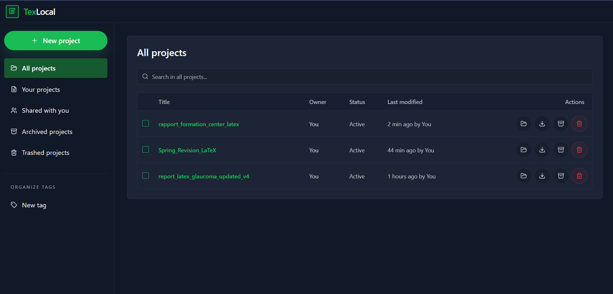
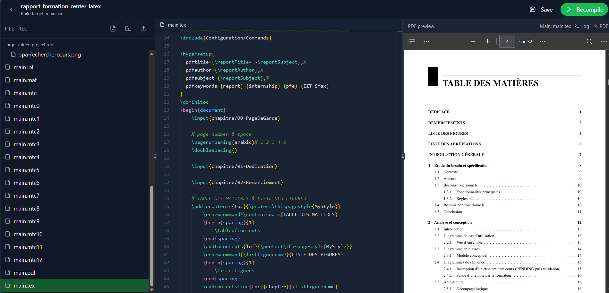

# TexLocal

TexLocal est une application locale pour créer, importer, éditer et compiler des projets LaTeX directement sur le PC de l'utilisateur, sans dépendance cloud.

## Captures de l'application

### Liste des projets

<p align="center">
  
</p>

<p align="center">
  Vue principale de l'application avec la liste des projets, la recherche, l'archivage, la corbeille et les actions de gestion.
</p>

### Éditeur LaTeX avec aperçu PDF

<p align="center">
  
</p>

<p align="center">
  Éditeur intégré avec arborescence des fichiers, édition du code LaTeX et aperçu PDF du document compilé.
</p>

## Fonctionnalités

- aucune dépendance cloud
- stockage sur le disque local de l'utilisateur
- compilation PDF via une distribution LaTeX installée sur la machine
- import de projet `.zip`
- gestion de `All projects`, `Archived` et `Trash`

## Architecture

L'application est composée de deux parties :

- un frontend React/Vite
- un serveur local Node/Express dans `local-server/`

## Quick Start

### 1. Cloner le projet

```bash
git clone https://github.com/amin8452/local-build-Latex.git
cd local-build-Latex
```

### 2. Installer les dépendances

```bash
npm install
```

Le backend local installe aussi ses dépendances automatiquement au lancement avec :

```bash
npm run dev:server
```

### 3. Choisir le dossier de sauvegarde des projets

Par défaut, les projets utilisateur sont stockés dans :

```text
~/TexLocalProjects
```

Sur Windows, cela correspond en général à :

```text
C:\Users\<username>\TexLocalProjects
```

Si vous voulez choisir un autre dossier :

1. copiez `local-server/.env.example` vers `local-server/.env`
2. modifiez `TEXLOCAL_ROOT`

Exemple Windows :

```env
TEXLOCAL_ROOT=C:\Users\asus\Documents\MesProjetsTexLocal
```

Exemple macOS / Linux :

```env
TEXLOCAL_ROOT=~/Documents/TexLocalProjects
```

Points importants :

- `TEXLOCAL_ROOT` est lu par le serveur local au démarrage
- les chemins relatifs sont résolus depuis le dossier `local-server/`
- le dossier est créé automatiquement s'il n'existe pas
- le chemin actif est visible au survol de l'indicateur `Local server online` dans l'interface et dans les logs du serveur

### 4. Lancer le backend local

```bash
npm run dev:server
```

Par défaut, le serveur écoute sur :

```text
http://localhost:3001
```

### 5. Lancer l'interface

Dans un deuxième terminal :

```bash
npm run dev:ui
```

Puis ouvrir :

```text
http://localhost:8080
```

## Utilisation

- `New project` crée un projet vide
- `Choose ZIP` dans la fenêtre de création permet d'importer une archive `.zip`
- `Archive`, `Move to trash`, `Restore` et `Delete permanently` fonctionnent via le backend local
- les fichiers du projet sont écrits directement sur le disque local de l'utilisateur

## Structure de stockage

Chaque projet est stocké dans un dossier propre :

```text
<TEXLOCAL_ROOT>/<project-id>/
```

On y trouve typiquement :

- `main.tex`
- les autres fichiers du projet
- `.texlocal.json` pour les métadonnées
- `main.pdf` après compilation

## Installation LaTeX

TexLocal a besoin d'une distribution LaTeX locale pour compiler les PDF.

### Windows

Installez l'un de ces outils :

- MiKTeX
- TeX Live

Vérifiez ensuite dans un terminal :

```bash
pdflatex -v
```

Optionnel :

```bash
latexmk -v
```

### macOS

```bash
brew install --cask mactex-no-gui
```

Vérification :

```bash
pdflatex -v
```

### Linux Debian / Ubuntu

```bash
sudo apt update
sudo apt install texlive-latex-extra latexmk
```

Vérification :

```bash
pdflatex -v
```

## Si LaTeX n'est pas installé

Si aucun moteur LaTeX n'est disponible dans le `PATH`, la compilation échouera. Installez une distribution LaTeX, fermez le terminal, puis relancez :

```bash
npm run dev:server
```

## Cas Windows : `latexmk` trouvé mais `perl` manquant

Sous Windows, MiKTeX peut fournir `latexmk.exe` sans fournir `perl`.

Dans ce cas, `latexmk` échoue avec un message du type :

```text
MiKTeX could not find the script engine 'perl'
```

TexLocal gère maintenant ce cas automatiquement :

- si `latexmk` et `perl` sont disponibles, il utilise `latexmk`
- sinon, il bascule sur `pdflatex`

Si vous voulez absolument utiliser `latexmk` sous Windows, installez aussi Perl, par exemple Strawberry Perl, puis redémarrez le serveur local.

## Si MiKTeX demande des packages manquants

Selon le document compilé, MiKTeX peut demander l'installation de packages supplémentaires.

Dans ce cas :

1. ouvrez MiKTeX Console
2. autorisez l'installation automatique des packages, ou installez les packages demandés
3. relancez la compilation

## Configuration

Variables importantes :

- `PORT` : port du serveur local Node
- `TEXLOCAL_ROOT` : dossier de sauvegarde des projets utilisateur
- `VITE_LATEX_API` : URL du backend utilisée par le frontend

Le fichier recommandé pour personnaliser le backend est :

```text
local-server/.env
```

## Scripts utiles

```bash
npm run dev:ui
npm run dev:server
npm run server
npm run build
npm test
```
